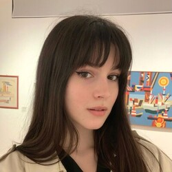
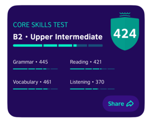

# Mariia Petrenko


## Contact information
* GitHub: [filisinia](https://github.com/filisinia)
* Discord: filisinia
* E-mail: filisinia@gmail.com
* Location: Kyiv, Ukraine

## About me
I am 20 years old and currently studying as a front-end developer. While I already possess some neccessary skills for this field, there is still much more for me to explore and learn. I am a quick learner, always prepared for new challenges and ready to make significant strides in the dynamic realm of web development.

## Skills
* HTML
* CSS (SASS/SCCS, BEM)
* JavaScript
* Git & GitHub
* VS Code
* Figma

## Code example
```
function generateHashtag (str) {
  let words = str.split(' ');
  
  for (let i = 0; i < words.length; i++) {
    words[i] = words[i].slice(0, 1).toUpperCase() + words[i].slice(1);
  }

  if (words.join('').split('').length >= 140 || words.join('').split('').length === 0) {
    return false;
  }

  return '#' + words.join('');
}
```
## Work experience
Creating a personal CV: [link](https://github.com/filisinia/rsschool-cv/blob/gh-pages/cv.md)

## Education
* Books of Dmitry Trepachov:
1. "HTML for Beginners"
2. "Advanced HTML and CSS"
3. "Fundamental JavaScript"

* YouTube channels:
1. FreelancerLifeStyle
2. Bogdan Stashchuk

* Practice on CodeWars

## Languages
* English - Upper-Intermediate (Every Saturday, I attend an English-speaking club, improving my skills more and more. Additionally, I reinforce my knowlege by learning new words, reading English books and watching TV shows)


* Ukrainian - native
* Russian - native